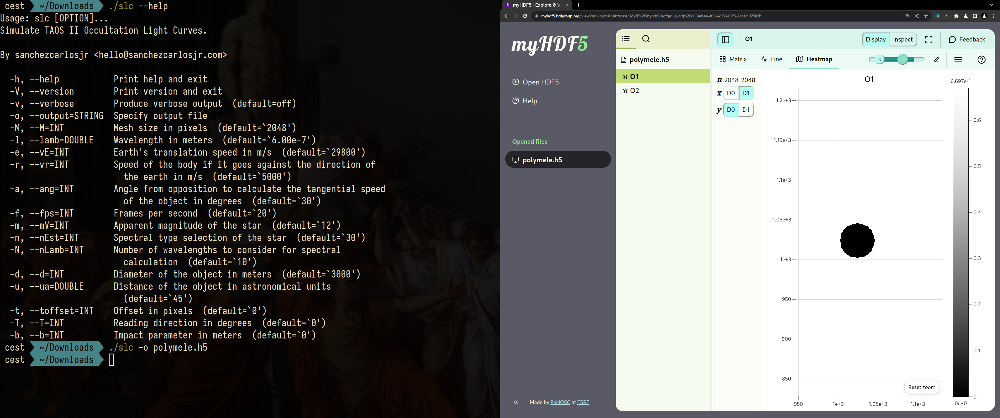

# Occultation light curve simulator



# Playground
Learn how to install and use the program through this [playground](https://colab.research.google.com/drive/1GCPLfTBvZLvwUEgk9O1yfWWH1MQAXUHs?usp=sharing).

# Installation
1. Install the shared libraries.

For example, on Arch Linux, you would run
```
sudo pacman -S fftw gsl hdf5
```

2. Download the [latest version](https://github.com/sanchezcarlosjr/occultation_light_curves/releases/latest/download/slc) from GitHub Releases, so you don't need to compile the repository; it just works.

# Usage
Start your simulation with default parameters and save your data into HDF5.

```bash
slc --output polymele.h5
```

## Available commands
```slc``` supports several options, each accessible through the ```slc``` command and through our library. For help on individual commands, add --help following the command name. The commands are available on [here](./cli/cli.ggo).


# HDF5 Viewer
https://myhdf5.hdfgroup.org/


# Contribution
To contribute to this repository, you must install CMake, a C99-compatible compiler, GSL, and FFTW. Additionally, modifications to the command line interface (CLI) may necessitate the installation of gengetopt.
As a good practice, we provide you with a test suite through Unity. This is a ready-to-go Git Submodule.

1. Clone the repository
git clone 

2. Install global dependencies. 
a. Install FFTW from this repository.
```
  cd external/fftw-3.3.10
  configure
  make
  make install
```

b. Install FFTW from this repository.

2. Cmake
```
cmake -B build && cmake --build build && cd build/bin/
```

